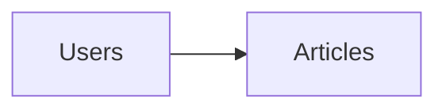

---
tags:
  - Spring-boot
  - Java
---

Relationships allow us to relate different tables.
In spring-boot we have annotations provided by `jpa` and this allow us to create relationships more easily.
## Basic concepts of relationships using entities and JPA
To define a relationship in JPA we need to define an **owner** table, the owner table is defined not by the relation design, but for where is placed the foreign key.
We have here a 1:M relation

In terms of design the user table is the owner, but for spring boot data jpa the owner is defined where is placed the foreign key, so the owner in this case is articles. This is the same for one to one and one to many relationships, but many to many where any of the tables don't have a foreign key, we can `select` an ***owner**.
To access to the different related values in our entities we must considered the different [[Fetching Strategies]].
Also we must ensure about the different types of cascade strategies [[Cascade strategies]].
## mappedBy
This is value for any relationship and here we can specify where is the "configuration".
```java
@OneToOne(mappedBy="user")
Address address;
```
for this relationship it's like saying the config is in the user field of this address.
## @OneToOne
[[Optional One to one relationship]]
Used to relate one to one relationships, we use ==@JoinColumn== to specify the foreign key to join and this is done in the owner entity.
```java
// this is the owner table
@Entity
class Address{
	@Id
	Integer id;

	@OneToOne
	@JoinColumn(name="id") // here the id itself is the primary key and the foreign key to user
	User user;
}

@Entity
class User{
	@Id
	@GeneratedValue(strategy=GenerationType.IDENTITY)
	Integer id;
	
	@OneToOne(mappedBy="user")
	Address address;
}

```
How the id of address is not autogenerated because is dependent of the id of article entity, so we need to specify this using `@MapsId`.
```java
@Entity
class Address{
	@Id
	Integer id;

	@OneToOne
	@MapsId
	@JoinColumn(name="id")
	User user;
}
```
We are saying that the id is the primary key of User entity.
## @ManyToOne | @OneToMany
Used for one to many relation ships, we need to be alert about where to put @ManyToOne and @OneToMany

```java
// this is the owner table
@Entity
class Address{
	@Id
	@GeneratedValue(strategy=GenerationType.IDENTITY)
	Integer id;

	@ManyToOne
	@JoinColumn(name="user_id")
	User user;
}

@Entity
class User{
	@Id
	@GeneratedValue(strategy=GenerationType.IDENTITY)
	Integer id;

	@OneToMany(mappedBy="user")
	Set<Address> addresses;
}
```
## @ManyToMany
Here we need to use `@JoinTable` in place of @JoinColumn because there is no direct foreign key. `@JoinTable` has a `name` to put the name of the name of the table many to many, a `joinColumns` field for the foreign key that is related to our current entity owner and a `inverseJoinColumns` for the foreign key of the *inverse* entity.
```java
// this is the owner table
@Entity
class User{
	@Id
	@GeneratedValue(strategy=GenerationType.IDENTITY)
	Integer id;

	@ManyToMany
	@JoinTable(
		name="user_tags", 
		joinColumns=@JoinColumn(name = "user_id"),
		inverseJoinColumns=@JoinColumn(name="address_id")
		)
	Set<Address> addresses;
}

@Entity
class Address{
	@Id
	@GeneratedValue(strategy=GenerationType.IDENTITY)
	Integer id;

	@ManyToMany(mappedBy="addresses")
	Set<User> users;
}

```

